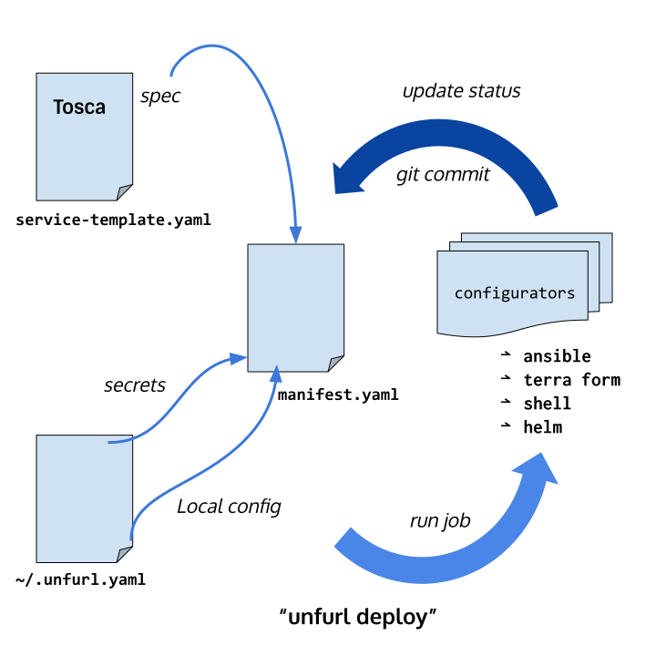

=========
Ensembles
=========

The core concept of Unfurl is that of a ``Ensemble``, a representation of an isolated collections of resources. An ensemble's identity is independent of the location or implementation of the resources it entails. Ensembles maintain an ordered set of `ChangeRecords <Config Change>` that represent the current operational state of those resources -- both their configuration and their internal state. For example, if an ensemble contained a database, its `ChangeRecord` might be tied to changes to the data in that database.

Like objects in a computer program, ensembles expose abstract, typed interfaces that encapsulates an internal implementation. They can create, delete, and modify resources and, with proper configuration, act as a secure gateway for managing those resources.

The key capability unlocked by ensembles is to provide a uniform encapsulation of applications and services across technologies and protocol layers. For example, consider the status quo: while a sophisticated engineering team could implement a dynamic service mesh on Kubernetes, have reproducible builds using Bazel and declarative infrastructure using Terraform, coordination between these technologies is still ad-hoc and bespoke.

Crucial semantics such as versioning or capability between components,
persistent and historical state, public URLs and identifiers that need to be maintained or propagated are cross-cutting concerns. Indeed an analysis of postmortems of failed deployments will show that a majority of stem from configuration mismatches like this.

By encapsulating ad-hoc processes with a uniform interface built around widely used and understood development tools such as git, it becomes dramatically easier to integrate and manage applications and services across organizational boundaries, whether engineering teams or business entities.

Repositories and History
========================

Changes to an ensemble's configuration or operational state are committed to a git repository, enabling a turnkey GitOps workflow. Git's immutable history helps guarantee integrity and reproducible playback as well as provide an auditable history of changes.

Unfurl can automatically commit any changes to the project to one or more git repositories. Unfurl provides flexibility on how to map this layout to git repositories, supporting both "monorepo" and "polyrepo" arrangements. An ensemble can keep instance data and specifications in  separate git repositories (useful for testing or ephemeral instances) and a project can live in a dedicated repository or be part of a source repository.

Isolation and Reproducibility
=============================

Reproducibility deployments is a major goal of Unfurl but because live service are non-deterministic in any number of ways, its concept of reproducibility is necessarily partial. It is like a function in a compute program: given inputs that meet some set of constraints, an ensemble should consistently produce outputs that conforms to some set of invariants.

As the above diagram illustrates, if we execute the Unfurl engine within a clean, isolated environment and have it target a well-defined, isolated cloud environment it is a lot easier to create consistent, reproducible deployments.
Then we can view it as an atomic entity and treat them much like we would a container and apply similar operations such as clone, migrate, pause and snapshot.

The deployment environment is set by specifying the :ref:`runtime environment<runtime>` that Unfurl runs in. It can be a Docker container or local isolation achieved through separate executables, environment variables, and Python virtual environment.

The cloud environment is more variable -- dependent on the application, for example, the isolation boundary could be a cloud provider account, a Kubernetes cluster, or a Kubernetes namespace. But any of those resources can be marked as a boundary, enabling Unfurl to apply the appropriate semantics and optimizations.

URIs
====

Each ensemble should declare an unique :ref:`uri<ensemble_yaml>` to establish its identity.
Ensembles can also have multiple :ref:`aliases<ensemble_yaml>`, additional URIs that are unique to that ensemble.
This enables ensembles to be renamed while still maintaining compatibility with references to the old URI. An Ensemble's identity is established by its ``uri`` not by its contents.

If you change an ensemble's :ref:`uri<ensemble_yaml>` along with any :ref:`aliases<ensemble_yaml>` it you are essentially forking
that ensemble because it will now be treated as a different ensemble.

Ensemble URI don't need to be resolvable or memorable but it is useful if they are. When you create a new ensemble Unfurl will autogenerate a URL that is the path to itself in the git repository it appears in. :ref`Aliases<ensemble_yaml>` can point to alternative locations or capabilities for the ensemble, for example a ``ssh`` URL to the git repository for clients with access for committing to the repository.

If you clone an ensemble into the same project or if the ensemble is in a standalone local repository (an ensemble that isn't in a project repository or in a repository that is a git submodule of a project repository) Unfurl will generate a new URI and remove any aliases. Otherwise, it won't change the URI and so the cloned ensemble will be treated as a copy of the source ensemble.

Anatomy of a Manifest
=====================

At the core of Unfurl is an :ref:`Ensemble<ensemble_yaml>` manifest, a YAML file that includes:

* A model of the cloud resources it manages (using the OASIS's `TOSCA` 1.3 ("Topology and Orchestration Specification for Cloud Applications") standard)
* Implementations of operations and workflows that can be applied to those resources (via :ref:`configurators<configurators>`)
* A record of the operational status of those resources.
* A record of the state of the repositories, artifacts, and runtime environment that were used during deployment.

Ensembles can be part of an Unfurl project that manages one or more git repositories which contain code, artifacts, configuration and operational history.

The main job of Unfurl is apply the workflows in the Ensemble and record the results. It creates a change log tracking which operations were applied to which resources and how those resources where changed. These changes can be committed to `git` automatically so that each commit represents an update to the state of the system.

While the implementation of operations can be specified natively in Unfurl, it is primarily intended as a coordinator of existing build and deployments tools, and in particular `Terraform` and `Ansible`. As such, Unfurl lets you mix and match both declarative and imperative approaches in the same project, and carefully designed, fine-grained models can live alongside course-grained objects  with ad-hoc metadata and dynamically generated configuration.

The status is presented as a hierarchy of the operational status and attributes of the live resources that were created, modified or observed while running a job.
