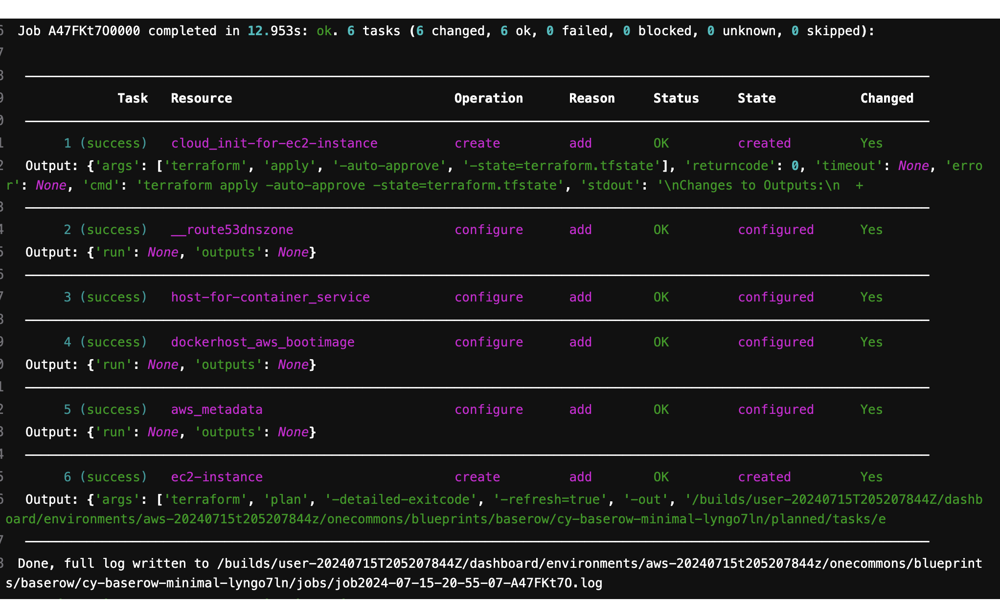

==================
Jobs and Workflows
==================

.. contents::
   :local:

The core behavior of Unfurl is to run a :std:ref:`Job` that executes a `workflow` on a given topology instance.

There are two fundamental workflows ("normative workflows" in TOSCA terminology):
`deploy`, which installs the topology, and `undeploy<teardown>`, which uninstalls it.

There are also :ref:`check` and  :std:ref:`discover` workflows which update the status of instances the based on their current live state.

Each of these workflows can be triggered with the equivalently named  :cli:`commands<unfurl-deploy-commands>`.  You can run custom workflows using :cli:`unfurl run<unfurl-run>`.

Job Lifecycle
==============

When a command that invokes a workflow is executed (`deploy`, `undeploy<teardown>`, :ref:`check`,  :std:ref:`discover` and :ref:`run`)
a job is created and run. Running a job entails these steps:

1. YAML parsed and :ref:`merge directives<yaml_merge_directives>` are processed, including converting `Python DSL<A TOSCA Python-based DSL>` code to TOSCA YAML.
2. Schema is validated and model instantiated. The command will exit if there are errors.
3. A plan is constructed based on the selected workflow and job options (use :cli:`unfurl plan<unfurl-plan>` command to preview) and the job begins.
4. For each operation a task is generated and the operation's :std:ref:`inputs` are lazily evaluated
   if referenced, including Unfurl expressions, TOSCA functions, and template strings.
5. If planned tasks require local dependencies to be installed, such as tool artifacts, run an external job to install them.
6. Render the plan. The command will exit if there are unrecoverable errors. Render operations that depend on live attributes that will be deferred until those attributes are set when the task is executed.
7. Execute the plan. You will be prompted with a plan summary to approve unless the ``--approve`` flag was used. As it runs, it tracks dependencies and changes to resource attributes and status.
8. Re-execute steps 5 and 6 to render and run any deferred operations if needed. Repeat until all operations complete.
9. After the job completes, `ensemble.yaml` is updated with any changes to its instances status. It's ``jobs`` folder with have new `job.yaml` file and associated log files.
10. If the ``--commit`` flag was set, the ensemble's git repository will see a new commit containing changes to any files touched by the job, along with commits to any other project repositories that had changes to it. And if the ``--push`` flag was set, the commits will be automatically pushed.

After the job finishes, a summary is printed showing the results of each operation along with any `outputs` defined in the model.

   Example deploy job output

Generated Files
===============

When a job runs it creates several directories and files, some of which are committed to the ensemble's git repository.

During the planning stage, tasks can generate ("render") files that are used during deployment. They are saved in the ``planned`` directory in one of the subdirectories described below. It is the task's `configurator`'s responsibility to creates the files it needs -- for example, the Terraform configurator might generate a terraform module.

During the deployment stage, those files are moved to the ``active`` directory after the task completes successfully. If it fails, they are moved to a directory named ``failed.<taskid>``.

When the job completes, ``job.tsv`` is updated and files for that job are added to ``changes`` and ``jobs`` directories.

The ``planned`` and ``active`` directories can have the following subdirectories:

:artifacts: Persistent artifacts required for deployment.
:secrets: Sensitive artifacts (e.g. certificates). They are vault encrypted in the repository.
:tasks: Transient generated configuration files (excluded from repository).

Below is an example showing the directory of a simple ensemble with one resource templates (ec2compute) that has been deployed once (with a `job id<changeids>` of A41VNXbB).

|  ├── ensemble.yaml
|  ├── changes
|  │   ├── job2024-01-31-23-33-37-A41VNXbB.yaml  
|  ├── jobs
|  │   ├── job2024-01-31-23-33-37-A41VNXbB.yaml
|  │   └── job2024-01-31-23-33-37-A41VNXbB.log
|  ├── jobs.tsv
|  ├── active
|  │   ├── artifacts
|  │   ├── secrets
|  │   │   ├── ec2compute
|  │   │   │   └── terraform.tfstate.yaml
|  │   └── tasks
|  │       ├── ec2compute
|  │       │   ├── main.unfurl.tmp.tf
|  │       │   ├── terraform.tfstate
|  │       │   └── vars.tmp.tfvars.json

``jobs.tsv``: a tab separated file with a line for each task and job designed for fast loading and conflict free merging.

``job2024-01-31-23-33-37-A41VNXbB.yaml`` is a `job.yaml` file. The one is in ``changes`` is committed, while the one is ``jobs`` is not. The latter is more verbose and may contain content that is not safe to commit.

 ``jobs/job2024-01-31-23-33-37-A41VNXbB.log`` is a copy of the log messages logged to console when the job was run.

``active/secrets/ec2compute/terraform.tfstate.yaml`` -- the Terraform configurator needs to commit its Terraform state as a secret because it may contain confidential data.

The files in ``active/tasks/ec2compute`` are used during deployment by Terraform and left in place for review even though they not committed and will be regenerated if missing.

See `Project folders` for the API configurators use to manage the files they need and :std:ref:`get_dir` and :std:ref:`abspath` for expression functions that provide access to this directories.

Of the above files and directories only 
``ensemble.yaml``, ``jobs.tsv``, ``changes``, ``active/artifacts`` and ``active/secrets`` are committed to git, the rest are excluded in the project's ``.gitignore`` file. Files excluded from git are safe to delete after the job completes.

Updating a deployment
=====================

After ensemble is created, running a job will compared with the current state of its resources.

The deploy workflow follows these rules:

* Any existing instance that not at the expecting status or state. (this is controlled by the --repair option). (reason: repair)
* Previously created resources already in their desired state are evaluated to see if their configuration changed (controlled by the --change-detection option) (reason: reconfigure).
* New templates will create new resources (reason "new") (disabled by the --skip-new flag)
* If the --check flag is set, the ``"check" operation`` will be run before trying to create the instance.
* Existing resources no longer referenced by the model are not removed unless the --prune flag is used. When --prune is used, deletion follows the rules of the `Undeploy (teardown)` workflow described below.

Applying configuration changes.
~~~~~~~~~~~~~~~~~~~~~~~~~~~~~~~~

By default, deploy jobs have the :cli:`--change-detection<cmdoption-unfurl-deploy-change-detection>` job option is set to "evaluate", which means the job will check if deployed resources need to updated because their configuration changed. 
Unfurl checks if they need to be updated by comparing a resource's current state as recorded in ``ensemble.yaml`` to the expected state given the current service template. If it differs, a configure operation will be added to the plan with the reason set to "reconfigure".

Note that it doesn't determine the state from live resources, just from the last known state recorded in the ensemble.

You can skip this check per resource by setting the "customized" field to true in the instance's status.
This indicates that the resource has intentionally diverged from its template and shouldn't be set back to that configuration. It is automatically set when a custom operation (including "discover" operations) modifies an attribute that was previously set or used by a configure operation -- Unfurl marks the instance as customized to prevent a future configure operation from overwriting those changes.

Setting the :cli:`--change-detection<cmdoption-unfurl-deploy-change-detection>` job option to "always" will ignore the "customized" field and potentially the configure operation will re-run and overwrite custom changes to the instance. Setting the :cli:`--change-detection<cmdoption-unfurl-deploy-change-detection>` job option to "skip" disables this check.

Changes are detected by comparing a digest of the values of the inputs and properties accessed the last time a configuration operation was run with a digest of their current values. (This is saved in the `Config Change` record.)  Changes to referenced files, directories, and container images are also included in the digest (via Unfurl's `External values` API). Note that sensitive values are excluded from the digest.

Undeploy (teardown)
=====================

The undeploy workflow (invoked by the :cli:`unfurl teardown<unfurl-teardown>` command) builds a plan where resources are deleted from the edges to the root, based on the topology's dependency graph -- essentially the reverse order of how it was deployed.

A resource will be excluded from deletion if any of the following are true:

* It was not created by the deployment (e.g. it was `discovered <Resource Discovery>`). This can be overridden by the :cli:`--destroyunmanaged<cmdoption-unfurl-deploy-destroyunmanaged>` job option. This is by the determined by the ``created`` field in the resource's status.

* It is managed by another resource. In that case, the name of the resource that manages it is the value of its ``created`` field. In this case, it is the responsibility of the managing resource's delete operation to also delete this resource.

* Its status has ``protected`` set to true.

* Its node template has the `"protected" directive <tosca.NodeTemplateDirective.protected>` set.

* It is a abstract, virtual, or imported resource.

* Resources whose removal will break required resources that we want to keep operational. The ``--force`` job option disables this check. Individual dependent resources can be excluded from this check by changing either their status or their `priority` from "required" to "optional" or "ignore".

Resource Discovery
==================

If a node template has a ``discover`` operation associated with it, Unfurl can use that operation to discover existing resources that match the template instead of creating a new resource.

Those operations will be invoked when by running the :cli:`unfurl-discover` command, which trigger the "discover" workflow.

When running the deploy workflow, you can indicate that individual node templates should discover its resource instead of creating it by setting the `discover node template directive <tosca.NodeTemplateDirective.discover>`.

Checking resources
==================

The ``check`` operation checks and updates the live state and status of a resource. It is typically run right before a deploy operation (e.g. create or configure) to check if that operation should be run or skipped. If any of the following are true, a check operation (if found) will be scheduled for a resource when running a deploy job:

* If the --check job option is set, check operations will be run first if the resource hasn't been created yet.
* the resource's status is set to "unknown"
* the resource's node template has the `"check" directive <tosca.NodeTemplateDirective.discover>`

You can also use the :cli:`unfurl check<unfurl-check>` command to the run the "check" workflow, which runs the "check" operation on all resources that have that operation defined.

Ad-hoc Jobs
===========

You can execute any operation across your ensemble using the :cli:`unfurl run<unfurl-run>` command. That command will create a job that executes the given operation on any instance that has that operation defined. Instance selection can be limited using the generic job filter options (e.g. :cli:`--operation<cmdoption-unfurl-run-instance>`).

.. code-block:: shell

  > unfurl run --operation Standard.start

``unfurl run`` can also execute ad hoc shell command in the context of your ensemble's environment. 

You can run an ad-hoc shell command in the context of your ensemble's environment. In place of the :cli:`--operation<cmdoption-unfurl-run-operation>` option, use ``--`` to separate the given shell command, for example:

.. code-block:: shell

  > unfurl run -- echo 'hello!'

If ``--host`` or ``--module`` is set, the `ansible configurator` will be used to execute the shell command on the give host (or localhost if omitted). For example:

.. code-block:: shell

  > unfurl run --host=my_server -- echo "hello!'

This will use ansible to connect to the resource named "my_server" in your ensemble and execute the shell command there.

Running an shell command will be executed once for each given ``--instance``, in that instance's context. The shell command will be evaluated in Jinj2a expressions. For example, this will the current instance's name: ``echo "hello {{ '.name' | eval }}'"``.  If none are present, the shell command will be executed once in the global context of the ensemble. (e.g. environment variables, executable versions via asdf). It can be saved in the job history with the ``--save`` flag.

Locking
=======

When a job is running Unfurl will lock the ensemble to prevent other instances of Unfurl from modifying the same ensemble.
There are two kinds of locks: a local lock that prevents access to the same local copy of an ensemble and a global lock which takes a `git lfs`_ lock to prevent access to the ensemble across remote servers.
Note that locks don't cause the job to block, instead the job will just abort when it starts if the lock was already taken. If a job aborts due to a lock, it is up to the user to re-run the job when the lock is free.

Local locks are a pid file based on the ensemble's path with ".lock" extension, e.g. "/path/to/ensemble/ensemble.yaml.lock". Local locking is per ensemble and is always enabled. Local locks can be manually freed by deleting that file.

Global remote locks need to be enabled via the ``lfs_lock`` section in your project's `environments<environment_schema>` configuration. The following settings are available:

:lock: Whether to use git lfs when locking an ensemble, it can be set to one of:

    "no", don't try to lock (the default if missing)

    "try", take a lock if th e git lfs server is available

    "require", abort job if unable to take a git lfs lock

:url: The URL of the Git LFS server to use. If missing, the ensemble's git repository's "origin" remote will be used.

:name: Name of the lock file to use. Note that with git lfs, the file doesn't need to exist in in the git repository. If omitted, the local lock's file path will be used.
  By setting this you can set the scope to be coarser (or narrower) than each individual ensemble as any ensemble using the same name will be locked.

  The following string substitutions are available to dynamically generate the name: ``$ensemble_uri``, ``$environment``, and ``$local_lock_path``. For example, setting a name like "group1/$environment" would prevent jobs from simultaneously running for ensemble with the lock name "group1" and in same the environment.

As these settings are `environment` settings, they will be merged with the current project, home project, and the ensemble's environment sections. Unlike most other environment settings, the ensemble's settings takes priority and overrides the project's settings.

Use ``git lfs locks`` to see existing locks in a git repository and ``git lfs unlock`` to manually remove a lock. 

In additional to locking, to ensure local deployments are in sync with each, when Unfurl starts and loads an ensemble it checks the project and ensemble's upstream repositories for changes. The :cli:`--skip-upstream-check<unfurl>` global option and the ``UNFURL_SKIP_UPSTREAM_CHECK`` environment variable disables this behavior.

.. _git lfs: https://git-lfs.com/

Operational status and state
=============================

When a workflow job is run, it updates the status of its affected instances.
Each `instance` represented in a manifest has a status that indicates
its relationship to its specification:

  :Unknown:  The operational state of the instance is unknown.
  :Pending:  Instance is being brought up or hasn't been created yet.
  :OK:       Instance is operational
  :Degraded: Instance is operational but in a degraded state.
  :Error:    Instance is not operational.
  :Absent:   Instance confirmed to not exist.

When a workflow is applied to an instance it will be skipped if it already has
the desired status (either "OK" or "Absent"). If its status is ``Unknown``,
:ref:`check` will be run first. Otherwise the workflow will be applied by executing one or more :ref:`operations<operation>` on a target instance.

If it succeeds, the target instance status will be set to either ``OK`` or ``Absent``
for `deploy` and `undeploy<teardown>`, respectively.
If it fails, the status will depend on whether the instance was modified by the operation.
If it has been, the status is set to ``Error`` (or to ``Degraded`` the task was optional);
if the operation didn't report whether or not it was modified, it is set to ``Unknown``.
Otherwise, the status won't be changed.

Node state
~~~~~~~~~~

In addition, each instance has a ``node state`` which indicates where the instance is in
it deployment lifecycle. Node states are defined by TOSCA and include:
``initial``, ``creating``, ``created``, ``configuring``, ``configured``,
``starting``, ``started``, ``stopping``, ``deleting``, ``deleted``, and ``error``.

As :ref:`operations<operation>` are executed during a job, the target instance's ``node state`` is updated.

.. seealso::

 :tosca_spec:`TOSCA 1.3, §3.4.1 <_Toc454457724>` for a complete definitions

ChangeIds
~~~~~~~~~

Each :ref:`task<tasks>` in a :std:ref:`Job` corresponds to an operation that was executed and is assigned a
`changeid`. Each task is recorded in the job's :ref:`changelog<job.yaml>` as a `Config Change`, which designed so that it can replayed to reproduce the instance.

ChangeIds are unique within the lifespan of an ensemble and sortable using an encoded timestamp.
All copies of an ensemble maintain a consistent view of time to ensure proper serialization and easy of merging of changes
(using locking if necessary).

Instances keep track of the last operation that was applied to it and also of the last
task that observed changes to the internal state of the instance (which may or may not be
reflected in attributes exposed in the topology model). Tracking internal state
is useful because dependent instances may need to know when it has changed and to know
if it is safe to delete an instance.

YAML example
~~~~~~~~~~~~

When status of an instance is saved in the manifest, the attributes described above
can be found in the `status` section of the instance, for example:

.. code-block:: YAML

  readyState:
    local: ok # the explicit `status` of this instance
    effective: ok #  `status` with dependencies' statuses considered
    state: started # Node state
  lastConfigChange: A0AP4P9C0001 # change id of the last ConfigChange that was applied
  priority: "optional"  # default Priority is "required"
  created: A0AP4P9C0001 # change id that created this or name of instance that manages this resource
  protected: true # (optional) prevents deletion
  customized: true # (optional) prevents reconfiguring from spec
