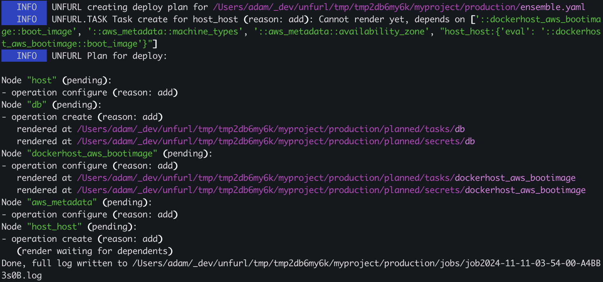
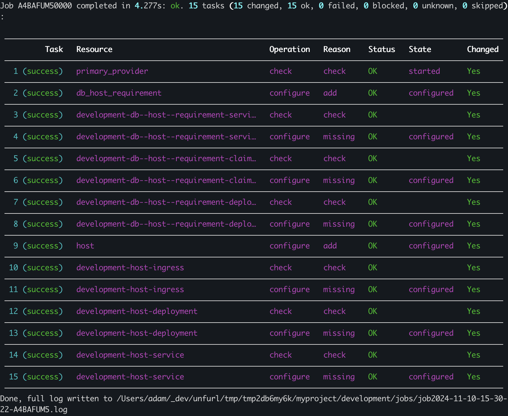

Quick start
===========

This section will introduce you to Unfurl by creating a simple project that deploys a web application. Once you get this working, you can customize it for your own application. 

.. tip::
  The steps here follow the high-level overview of Unfurl found in the `solution-overview` chapter.

Step 1 Create a project
-----------------------

The first step is to create an Unfurl project to manage your deployments:

.. code-block:: shell

    unfurl init myproject --empty --var std true --design

This is will create an Unfurl project in directory "myproject".  The :cli:`--empty<cmdoption-unfurl-init-empty>` option skips creating an ensemble (a deployment) for now (we'll add that later in `step 3<Step 3 Instantiate your blueprint>`).
The :cli:`--var<cmdoption-unfurl-init-var>` option passes settings to the `project skeleton <project skeletons>` templates that create the project. When the default project skeleton sees ``std``, it adds our |stdlib|_ repository, which includes TOSCA types that provide basic abstractions for resources like compute instances and container images.

The :cli:`--design<cmdoption-unfurl-init-design>` option initialized your project for development, in particular, it will download the ``std`` repository so that if you open ``service_template.py`` in an Python IDE such as VS Code the Python import statements will resolve, enabling your editor's type checking and code navigation.
(If you didn't do use that option, this will happen when you first deploy an ensemble or when you run the :cli:`validate<unfurl-validate>` command.)

If this is the first time you've created a Unfurl project, you'll notice a message like "Unfurl home created at ~/.unfurl_home".  Unfurl home is an Unfurl project that contains local settings and resources that are shared with other projects on that machine, including an isolated execution environment to run Unfurl in. For more information, see `Unfurl Home`.

Step 2: Describe your application
---------------------------------

Now that your project is set up, we'll create an TOSCA `blueprint<Step 2: Create a cloud blueprint>` for deploying our application. In this example, its a container image of a simple nodejs web app that requires a connection to a Postgres database. Here are some of things we need to do to deploy this web application:

* Create a service that can run the container image.
* Deploy a database and connect it to the web app.
* Consider DNS to resolve to the web app.

You can create your TOSCA blueprint in either YAML or Python. If you want to use YAML, add the blueprint to the project's ``ensemble-template.yaml`` file so that it can be reused by different :doc:`ensembles`. If you want to follow along using the Python examples, edit the ``service_template.py`` file.

Copy the code below to either service_template.py or ensemble-template.yaml. They are equivalent, in fact you can `bi-directionally convert<usage>` them using the :cli:`unfurl export<unfurl-export>` command.

.. tab-set-code::

  .. literalinclude:: ./examples/quickstart_service_template.py
    :language: python

  .. literalinclude:: ./examples/quickstart_service_template.yaml
    :language: yaml

Here we declare a few abstract resources: a service to run the container, a Postgres database, and a web application as the public root of the blueprint, along with some :std:ref:`inputs` to parameterize the blueprint. The parts of the blueprint that are not abstract are specific to our actual application: the container image we'll use and the environment variables it expects.  In the next step we'll instantiate those abstract types with implementations appropriate for the environment we're deploying into.

Step 3 Instantiate your blueprint
---------------------------------

Now that we have a model, we can customize for different environments.
In this example, let's suppose there are two types of environments we want to deploy this into:

* A production environment that deploys to AWS that installs the app on EC2 compute instance and deploys an AWS RDS database.
* A development environment that runs the app and Postgres as services on a local Kubernetes cluster.

Let's create those environments, along with a deployment for each:

.. code-block:: shell

   cd myproject
   unfurl init production --skeleton aws --use-environment production
   unfurl init development --skeleton k8s --use-environment development

The ``--skeleton`` option lets you specify an alternative to the default project skeleton. We'll assume we're deploying it into AWS so we will use the ``aws`` project skeleton. You can see all the built-in project skeletons :unfurl_github_tree:`here <unfurl/skeletons>` or use an absolute path to specify your own. 

.. important::

  Store the master password found in ``ensemble/local/unfurl.yaml`` in a safe place! By default this password is used to encrypt any sensitive data committed to repository. See :doc:`secrets` for more information.

There are different approaches to customize a blueprint for different environments but a simple one is to declare deployment blueprints. A `deployment blueprint` is a blueprint that is only applied when its criteria matches the deployment environment. It inherits from the service template's blueprint and includes node templates that override the blueprint's.  In YAML, they are declared in ``deployment_blueprints`` section of an ensemble. In Python, a `deployment blueprint` is represented as a Python class with the customized template objects as class attributes.

Add the following code below the code from the previous step:

.. _deployment_blueprint_example:

.. tab-set-code::

  .. literalinclude:: ./examples/quickstart_deployment_blueprints.py
    :language: python

  .. literalinclude:: ./examples/quickstart_deployment_blueprints.yaml
    :language: yaml

Here, each deployment blueprint replaces the "host" and "db" node templates with subclasses of those abstract types that are specific to the cloud provider we want to deploy into.

If you look at those `implementations <https://unfurl.cloud/onecommons/std>`_, you'll see they invoke Terraform, Ansible, and Kompose. If we defined our own types instead of using these predefined ones, we'd have to implement `operations<Interfaces and Operations>` for deploying them. See the `Configurators` chapter to learn how to implement your own as `Ansible` playbooks, `Terraform` modules, or by invoking `shell` commands.

You can use the :cli:`unfurl plan<unfurl-plan>` command to review the scripts and artifact Unfurl generates to deploys your ensemble. For example if we run 

.. code-block:: shell

  unfurl plan production

You'll see something like this:

   

   ``unfurl plan production`` output

The plan's output includes the location of files that were generated ("rendered") while creating the plan, for example, a Terraform module to deploy the AWS RDS database -- see `generated files`.

Step 4. Deploy and manage
-------------------------

Now we're ready to deploy our application.  Run :cli:`unfurl deploy development<unfurl-deploy>` from the command line to deploy the development ensemble. You can also use the ``--dryrun`` flag to simulate the deployment.

After the job finishes, a summary is printed showing the results of each operation:

   
   ``unfurl deploy development`` output

🎉 Congratulations on your first deployment with Unfurl! 🎉

Now that you've deployed your ensemble, here are some ways you can manage your deployment:

* Commit your changes with :cli:`unfurl commit<unfurl-commit>`. This will commit to git the latest configuration and history of changes made by the deployment, encrypting any sensitive data. (Or use ``--commit`` flag with the deploy :cli:`unfurl deploy<unfurl-deploy>` command to do this automatically.)

* Run `unfurl serve --gui<Browser-based Admin User Interface>` to view and manage your deployment. Or host your repositories on `Unfurl Cloud`_ for a full-fledged, multi-user admin experience.

* Run `Ad-hoc Jobs`.

* If you make changes to your deployment's configuration, re-running `unfurl deploy<Updating a deployment>` will update the existing deployment.

* Delete it using the `unfurl teardown<Undeploy (teardown)>` command.

Step 5. Share and Collaborate
-----------------------------

To share your blueprint and deployment, push your repository to a git host service such as Github or Gitlab (or better yet, `Unfurl Cloud`_!). You just have to `configure git remotes<Publishing your project>` for the git repositories we created.

When we ran :cli:`unfurl init<unfurl-init>`, we relied on the default behavior of creating a separate git repository for each ensemble. This allows the project's blueprints and deployments to have separate histories and access control. This way we can make the blueprint repository public but limit access to the production repository to system admins. In either case, you'd use the `unfurl clone<Cloning projects and ensembles>` command to clone the blueprint or the ensemble.

If you want to create a new deployment from the blueprint, clone the blueprint repository -- by default, Unfurl will create a new ensemble using the blueprint unless the ``--empty`` flag is used.

If you want to manage one of the deployments we already deployed, clone the repository that has that ensemble. 

.. tip::

  If we had used ``--submodule`` option with :cli:`unfurl init<unfurl-init>` (or manually added a submodule using ``git submodule add``) then the unfurl clone command would have cloned those ensembles too as submodules.

Once multiple users are sharing your projects, start `exploring<step5>` the different ways you can collaborate together to develop and manage your blueprints and deployments.
