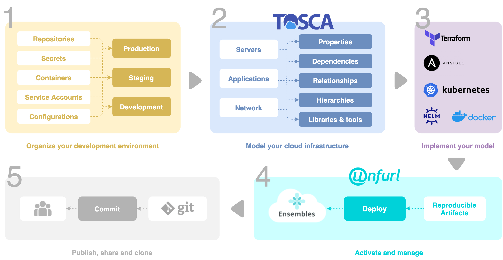
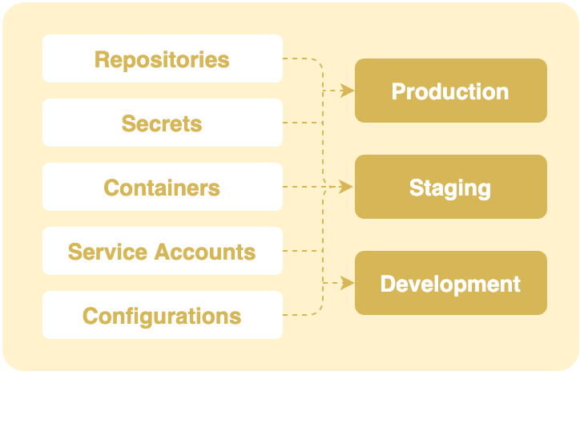
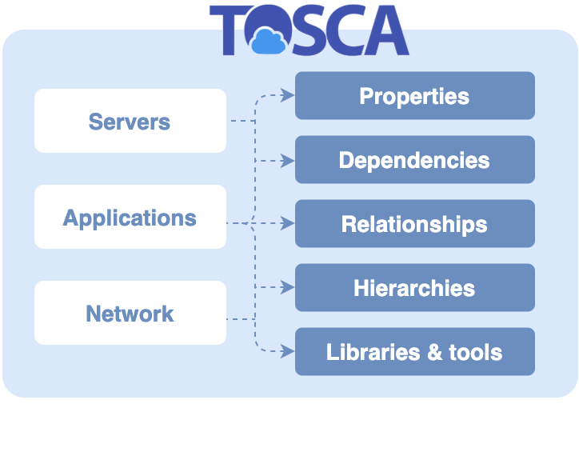
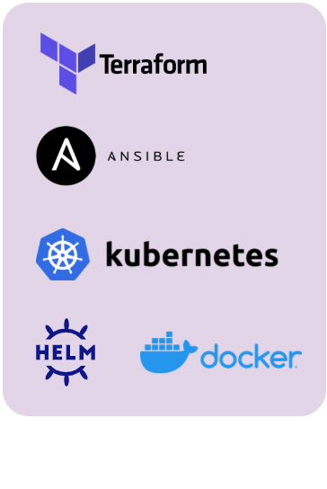
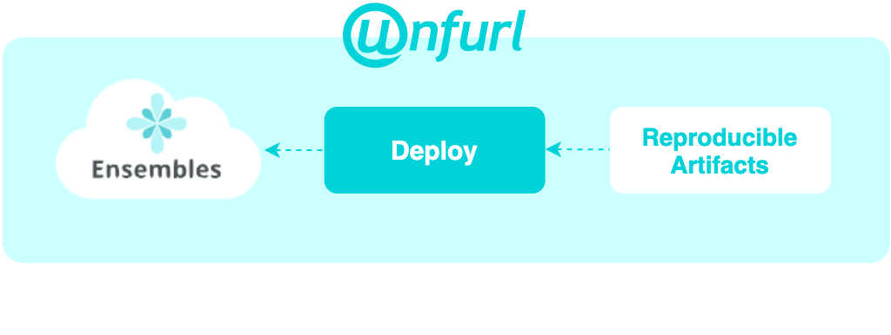
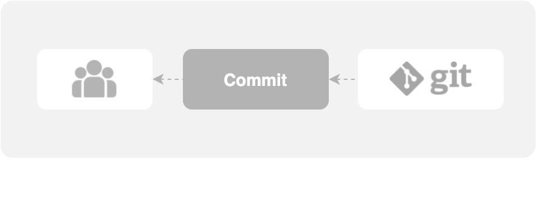

Solution Overview
=================

Before getting started, it is important to get yourself familiar with the overall unfurl solution.

Unfurl is a tool, offered by OneCommons, that allows you to keep track of the changes on the DevOps infrastructure and deploy it. This information can come in handy if you ever want to go back and see exactly how did you make those configuration changes alongwith what results did you get with that configuration. All this information can help with recreating that environment again.

The question arises, how is it done? Basically, Unfurl integrates with the deployment tools you are already using, like Ansible, Terraform and Helm, organizing their usage into Ensembles, shareable abstractions that ease migrations to new environments as well as share and reuse your work.

Let's dive a bit deeper into the solution.

.. _how_it_works:

How It Works
++++++++++++++

In this section, we will go through each step involved in whole process from deploying the changes to production to pushing everything on git. The figure below gives a high level overview of each step.

|

We will go through each step in this section.

* :ref:`Step 1: Organize your deployment environment<step1>`
* :ref:`Step 2: Model your cloud infrastructure<step2>`
* :ref:`Step 3: Implement your model<step3>`
* :ref:`Step 4: Activate and manage<step4>`
* :ref:`Step 5: Publish, share and clone<step5>`

.. _step1:

Step 1: Organize your deployment environment
--------------------------------------------

Unfurl allows you to collect your configuration information and organize them into contexts.
Contexts are used to create isolated environments that the Unfurl deployment process runs in. For example, you might create different context for different projects or different deployment environments such as **production** or **staging**.

Unfurl stores the local contexts such as environment variables in an ``.unfurl_home`` ensemble that represents its local environment. So you can use all its functionality to manage the local machine it is running on, for example, it can:

- Automatically install project dependencies such as packages and executables.
- Store configuration history in the ensemble’s local git repository
- Manage external git repositories needed for development and deployment (e.g. automatically clone remote repositories)

.. seealso:: To setup your environment, refer to the :ref:`Configure your home environment<configure>` section.

.. _step2:

Step 2: Model your cloud infrastructure
---------------------------------------

Specify your servers, applications, network, etc. with a declarative model that describes resources and their properties, dependencies, and relationships using the OASIS’s Topology and Orchestration Specification for Cloud Applications (TOSCA) standard. Leverage the TOSCA ecosystem of existing model libraries and tools.

.. note:: 

 * TOSCA supports abstract type hierarchies and reusable templates for resources and relationships so your models can be truly cloud-agnostic. 
 * For more information, refer to :ref:`TOSCA<tosca>` section.

The following key points are important to note:

* Topology also can describe its surrounding cloud environment such as required external resources so the deployment process can validate and adapt to its environment.

* Models can be vague with ad-hoc properties or they can be detailed and precise with strongly typed nodes and relationships, depending on need, and they can be incrementally refined over time.

* Models can be dynamically generated and updated as part of the deployment process, for example from Helm charts or Terraform modules.

.. seealso:: To model your cloud infrastructure using TOSCA, refer to the :ref:`Create a service template<create_servicetemplate>` section.

.. _step3:

Step 3: Implement your model
----------------------------

Once you’ve specified the model, you can now associate it with operations and workflows in YAML using plugins called **configurators**, which integrate configuration tools, such as :ref:`Shell scripts<shell>`, :ref:`Terraform<terraform>`, :ref:`Ansible<ansible>` and :ref:`Python<python>`.

Among the domain-specific configurators, :ref:`Docker<docker>`, :ref:`Kubernetes<kubernetes>`, :ref:`Helm<helm>` and :ref:`Supervisor` are included.

The YAML configuration language covers for multiple facilities for processing an operation’s inputs and outputs, including:

* A path based expression language for querying resources and configuration
* Apply Jinja2 templates with Ansible filters.
* Mark values and files as sensitive so they can be treated as secrets.
* Files touched by the configurators are automatically committed to the repository and their changes are included in dependency analysis.

.. seealso:: To know more about implementing your model using TOSCA, refer to the :ref:`Implementing an operation<implement_operation>` section.

.. _step4:

Step 4: Activate and manage
----------------------------

At this stage, you are ready to deploy your model. Run ``unfurl deploy`` from the command line and it will execute a plan. As it is running it tracks changes resource attributes and status and when it is complete it commits that to a Git repository. mirror not just the configuration but the state and status of live running services.

.. note::

 * If you are already have live resources Unfurl supports **discover** and **check** workflows for detecting and syncing resources and operational state.

 * Unfurl supports incremental deployment and has a repair mode which can greatly accelerate development and testing development.

Unfurl excels at **day two** operations such as backups, repairs and upgrades:

* It is easy to define your own workflows, interfaces and operations.
* You can also execute ad-hoc operations that will be recorded in git.
* Intelligent and fast incremental updates: Because Unfurl maintains a history of configuration changes and live operational state it can more employ more effective incremental update strategies.
* Maintaining an operational history makes it easier to diagnose and rollback problems.

.. _step5:

Step 5: Publish, share and clone
---------------------------------

You can share and clone Unfurl projects and ensembles just like you share and clone git repositories. Because Unfurl cleanly separates secrets and local settings Unfurl repositories are self-contained and location independent.

Like a git repository your Unfurl repository can be private or public, but either way, when you publish your ensemble the real power of Unfurl kicks in. Now other Unfurl projects can import and reference it, much like you import a module or package in a software program.

Once imported, other ensembles can reference the ensemble’s exported api endpoints, network resources or artifacts in their models, selecting them based on their type and other declared constraints.

.. seealso:: To know more about publishing your project, refer to the :ref:`Publish your project<publish_project>` section.

What Does That Mean 
++++++++++++++++++++

Whereas the possibilities are endless with such an open source cloud infrastructure, here are a few use cases associated with Unfurl.

Cloud agnostic and location independent
----------------------------------------

And because Ensembles maintain a persistent identity you can maintain these relationships as their internal implementations change – even if their locations change, even if they migrate to different cloud providers using a very different implementations. Or not: these references can also detect changes that violate the declared contracts between ensembles.

Cloud as code
--------------

Because Ensembles not just contain configuration but also reflects the state of live instances you can use the same development processes you for coding to also manage your IT infrastructure, for example:

- Use pull requests and sign-offs to manage updates and changes.
- Use feature branches and forks to manage deployment strategies
- Use CI/CD tests to validate changes
- Use git web hooks to trigger automated deployment to enable secure resource isolation