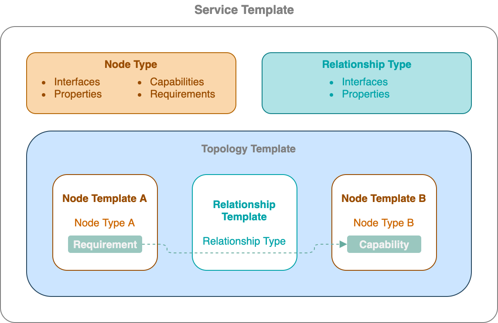

TOSCA
=====

Introduction
~~~~~~~~~~~~

Topology and Orchestration Specification for Cloud Applications also abbreviated as TOSCA is an OASIS open standard that defines the interoperable description of services and applications hosted on the cloud and elsewhere. This includes their components, relationships, dependencies, requirements, and capabilities, thereby enabling portability and automated management across cloud providers regardless of underlying platform or infrastructure. 

TOSCA sepcification allows the user to define service template. The service generally refers either to an application or an application component. This may include a firewall, database config, etc or any other configuration following some set of rules. In order to successfully author a TOSCA template, it is important to understand the various terms used within this specification and how are they interlinked.

.. seealso:: For more information, please refer to the `TOSCA Documentation. <https://www.oasis-open.org/standard/tosca/>`_

Components of TOSCA Specification
~~~~~~~~~~~~~~~~~~~~~~~~~~~~~~~~~~

A Node Template and a Relationship Template are the building blocks of any TOSCA Specification.The diagram figure below provides a high level overview of how different components involved within the TOSCA sepcification.

.. https://app.diagrams.net/#G1rbe28yAmiULdCV2mtNJ_b0AWJFiG0iVi

Service Template
^^^^^^^^^^^^^^^^^

A Service Template consists of all the application or topology specific information and important configuration that is required to move the application from one cloud platform or infrastructure to another. For example, a service template can be created for a database server or a router. All this configuration can be defined in the form of schema. The figure shown above displays the components of a service template. In order to deploy a service template, the node and relationship information is needed to deploy a Service template. We will go through each of these in the sections below.

Node Type
^^^^^^^^^^

A Node Type includes all the operational details required to create, start, stop or delete a component or an event. All the operational possibilities, operations, properties, capabilities and requirements of resources or components which will be consumed during a deployment are defined within a node type. This information can then later be reused in a node or a relationship template.

Relationship Type
^^^^^^^^^^^^^^^^^

A Relationship Template defines the interconnections that can take place between node types or node templates. In other words, it is a reuseable entity contaning definations of the relationships and the details on the nature of connectivity that can be used by an orchestration engine while working with various components of a service template.

Topology Template
^^^^^^^^^^^^^^^^^^

Topology Template refers to the topology model of a service. This model consists of node template and relationship template that are linked together to translate and structure the application in the form of TOSCA specification. A topoloigy template consists of reusable patterns of information defined in the node and relationship type.

Node Template
^^^^^^^^^^^^^

A Node Template defines an instance or a component of the application translated in the service template. Where a node type refers to the class or family of component at a high level that your resource belongs to, a node template makes use of the components defined in the node type and customizes the predefined properties and operations based upon the use case. The node templates also include operations such as deploy(), connect() to successfully and efficiently manage this component. Example: Shutting down an instance on the application server or hosting a container.

.. seealso:: To know more about these terminologies, refer to the :ref:`Glossary<glossary>` section.

The definitions of the application components within a node template have a potential to be reused later in the TOSCA specification by exporting the node dependencies using requirements and capabilities. The idea is to spcify the characteristics and the available functions of the components of a particular service in the form of nodes for future use.

Relationship Template
^^^^^^^^^^^^^^^^^^^^^

A Relationship Template specifies the relationship between the components defined in the node templates and how the various nodes are connected to each other. Apart from the connections, relationship templates also include information regarding the dependencies and the order of the deployment that should be followed to instantiate a service template.

An important thing to notice here is, in a relationship, it is important for the node requirements of a component to match the capabilities of the node it is being linked to.

Description
-----------

* As we can see ``unfurl.nodes.Installer`` derives the interfaces from ``tosca.nodes.Root`` which was defined in the definition above it. ``tosca.nodes.Root`` has also been derived in the subsequent examples.
* ``unfurl.nodes.Installer.Terraform`` makes use of the ``defaults``, ``Standard`` and ``Install`` interfaces.

Extensions
~~~~~~~~~~

* add 'any' schema type for properties and attributes definitions
* 'additionalProperties' field in type metadata
* allow metadata field on inputs, outputs, artifacts, and repositories
* add "sensitive" property and datatype metadata field
* add "immutable" property metadata field
* add "environment" keyword to implementation definition
* add "eval" function
* add "type" in capability assignment
* allow workflow to be imported
* workflow "target" accepts type names
* groups can have other groups as members
* An operation's ``operation_host`` field can also be set to a node template's name.
* added ``OPERATION_HOST`` as a reserved function keyword.
* add "discover" and "default" directives
* add "default_for" keyword to relationship templates
* add "defaults" section to interface definitions

Not yet implemented and non-conformance with the TOSCA 1.3 specification
~~~~~~~~~~~~~~~~~~~~~~~~~~~~~~~~~~~~~~~~~~~~~~~~~~~~~~~~~~~~~~~~~~~~~~~~

* The ``get_operation_output`` function (use `resultTemplate` instead)
* "copy" keyword (use the ``dsl`` section or `merge directives` instead)
* `get_artifact` function (only implemented for artifacts that are container images)
* CSAR manifests and archives (implemented but untested)
* substitution mapping
* triggers
* notifications
* node_filters
* xml schema constraints

Extensions to built-in definitions
~~~~~~~~~~~~~~~~~~~~~~~~~~~~~~~~~~

.. include:: tosca-ext.yaml
   :code: YAML
