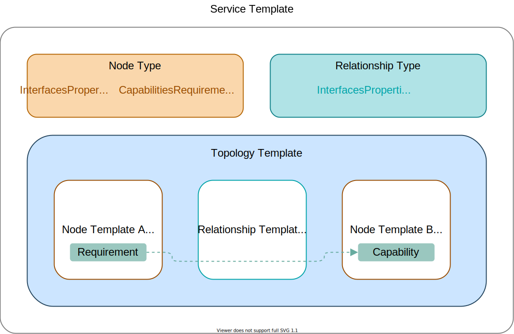

.. _tosca:

TOSCA
=====

.. contents::

Introduction
^^^^^^^^^^^^

The Topology and Orchestration Specification for Cloud Applications (TOSCA) is an `OASIS open standard <https://www.oasis-open.org/committees/tc_home.php?wg_abbrev=tosca>`_ that provides language to describe a topology of cloud based web services, their components, relationships, and the processes that manage them. TOSCA provides mechanisms for abstraction and composition, thereby enabling portability and automated management across cloud providers regardless of underlying platform or infrastructure. 
 
The TOSCA specification allows the user to define a `service template` which describes an online application or service and how to deploy it. In order to successfully author a TOSCA service template, it is important to understand the various components used within the TOSCA specification and how are they interlinked:

* *Node templates* describe the resources that will be instantiated when the service template is deployed. They are linked to other nodes through relationships.
* *Relationship templates* can be used to provide additional information about those relationships, for example how to establish a connection between two nodes.
* *Interfaces* that define operations on nodes that are invoked by a TOSCA orchestrator like Unfurl. TOSCA defines a standard interface for lifecycle management (deploying, starting, stopping and destroying resources) and the user can define additional interfaces for "Day Two" operations, such as maintainence tasks.
* *Artifacts* such as container images, software packages, or files that need to be deployed or used as an implementation for an operation. 
* *Policies* which define a condition or a set of actions for a Node. The orchestrator evaluates the conditions within the Policy against events that trigger. The required actions are then performed against the corresponding Interfaces.
* *Workflows* allows you to define a set of manually defined tasks to run in a sequential order.
* *Type definitons* TOSCA provides an object-oriented type system that lets you declare types for all of the above components as well as custom data types.

.. seealso:: For more information, see the full `TOSCA Language Reference`.

Core TOSCA Concepts
^^^^^^^^^^^^^^^^^^^

The figure below illustrates the core components of a TOSCA service template.
At the heart of a TOSCA service template is a `topology template` that describes a model of the service's online resources, including how they connect together and how they should be deployed. These resources are represented by a `node template`. 
The Node Template and a Relationship Template are the building blocks of any TOSCA Specification. 

.. https://app.diagrams.net/#G1rbe28yAmiULdCV2mtNJ_b0AWJFiG0iVi

Service Template
^^^^^^^^^^^^^^^^^

A TOSCA service template contains all the information needed to deploy the service it describes. In Unfurl, a service template can be a stand-alone YAML file that is included in the `ensemble.yaml` configuration file or embedded directly in that file as a child of the :tosca_spec:`Service templates<DEFN_ELEMENT_SERVICE_TEMPLATE>` element.

A service template has the following sections:

* :doc:`Metadata <toscaref/spec-tosca_def_version>` sections, which includes the ``tosca_definitions_version``, ``description``, ``metadata``, ``dsl_definitions``
* `imports` and `repositories` sections 
* Types sections that contain types of Node, Relationships, Capabilities, Artifacts, Interfaces, Policy and Groups
* Topology Template which include sections for :std:ref:`Inputs`, ``outputs``, Node and relationship templates, :ref:`substitution_mappings<substitution_mapping>`, `groups`, :ref:`policies<policy>` and `workflows`.

Example
-------

.. code:: yaml

  tosca_definitions_version: tosca_simple_unfurl_1_0_0 # or use the standard tosca_simple_yaml_1_3
  description: An illustrative TOSCA service template 
  metadata: # the following metadata keys are defined in the TOSCA specification:
    template_name: hello world
    template_author: onecommons
    template_version: 1.0.0

  repositories:
     tosca-community-contributions:
       url: https://github.com/oasis-open/tosca-community-contributions.git
   
     docker_hub:
       url: https://registry.hub.docker.com/
       credential:
           user: user1
           token:
             eval: # eval is an Unfurl extension
               secret:
                 dockerhub_user1_pw
   
   imports:
   
   - file: my-shared-types.yaml
     namespace_prefix: base # optional
   - file: profiles/orchestration/1.0/profile.yaml
     repository: tosca-community-contributions
   
  node_types:
     # ... see the "entity types” section below

  topology_template:    
     # ... see the “topology_templates” section below
     node_templates:
     # ... see the node_templates section below
     relationship_templates:
     # ... see the relationship_templates section below

Entity Types
^^^^^^^^^^^^

Every entity in TOSCA (including Nodes, Relationships, Artifacts and Data) has a declared type and custom type hierarchies can be defined in the `Service Template`.
Types declare the required properties, default definitions, and interface operations for an entity. Each type of entity has can have its own section in the service template, for example, ``node_types``, ``relationship_types``, ``data_types``,``artifact_types``, ``interface_types``, etc.

Example
-------

.. code:: yaml

 node_types:
      myApplication:
        derived_from: tosca.nodes.SoftwareComponent
        attributes:
          private_address:
            type: string
        properties:
         domain:
          type: string
          default: { get_input: domain }
          ports:
            type: tosca.datatypes.network.PortSpec
        requirements:
          - host:
              capabilities: tosca.capabilities.Compute
              relationship: tosca.relationships.HostedOn
          - db:
              capabilities: base:capabilities.postgresdb
              relationship: tosca.relationships.ConnectsTo
        interfaces:
          # TOSCA defines Standard interface for lifecycle management but you can define your own too
          Standard:
            create: create.sh
            configure: configure.sh
            delete: delete.sh

Topology Template
^^^^^^^^^^^^^^^^^^

Topology Template refers to the topology model of a service. This model consists of node template and relationship template that are linked together to translate and structure the application.

Example
-------

.. code:: yaml

 topology_template:

   inputs:
     domain:
       type: string

   outputs:
     url:
       type: string
       value: { concat: [ https://, { get_input: domain }, ':',  { get_attribute: [ myapp, portspec, source ] }, '/api/events'] }
       # Unfurl also support ansible-enhanced jinja2 template so you could write this instead:
       value: https://{{ TOPOLOGY.inputs.domain }}:{{ NODES.myApp.portspec.source }}/api/events

Node Template
^^^^^^^^^^^^^

A Node Template defines an instance or a component of the application in the service template. Where a node type refers to the class or family of component at a high level that your resource belongs to, a node template makes use of the components defined in the node type and customizes the predefined properties and operations based upon the use case.

.. seealso:: To know more about these terminologies, refer to the :ref:`Glossary<glossary>` section.

Example
-------

.. code:: yaml

   node_templates:

     myApp:
       type: myApplication
       artifacts:
         image:
           type: tosca.artifacts.Deployment.Image.Container.Docker
           file: myapp:latest
           repository: docker_hub
       requirements:
         - host: compute
         - db:
             node: mydb 
             relationship: mydb_connection
               
     mydb:
       type: base:postgresdb
       properties:
          name: mydb

     compute:
       type: unfurl.nodes.Compute
       capabilities:
         host:
           properties:
             num_cpus: 1
             disk_size: 200GB
             mem_size: 512MB

Relationship Template
^^^^^^^^^^^^^^^^^^^^^

A Relationship Template specifies the relationship between the components defined in the node templates and how the various nodes are connected to each other. Apart from the connections, relationship templates also include information regarding the dependencies and the order of the deployment that should be followed to instantiate a service template.

An important thing to notice here is, in a relationship, it is important for the node requirements of a component to match the capabilities of the node it is being linked to.

Example
-------

.. code:: yaml

  relationship_templates:
    mydb_connection:
      type: base:relationships.dbconnection
      properties:
        username: myapp
        password:
          eval:
            secret:
              myapp_db_pw

Complete Example
^^^^^^^^^^^^^^^^^^^^^^^^^^^^^^^^^^^^^^^^^^^^^

Combining the above examples into one file, we have a complete service template:

.. include:: examples/service-template.yaml
   :literal:
   :code: YAML

