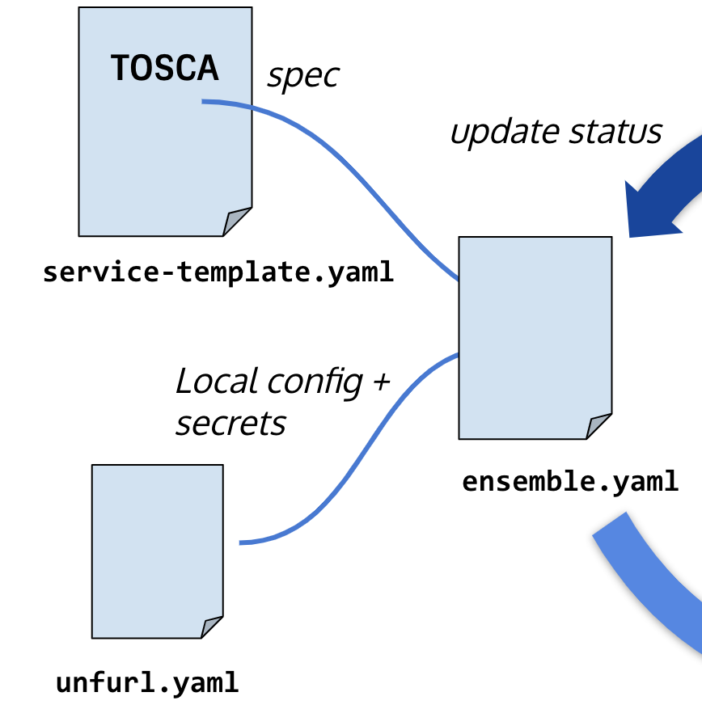

TOSCA
=====

Introduction
~~~~~~~~~~~~

Topology and Orchestration Specification for Cloud Applications also abbreviated as TOSCA is an OASIS open standard that defines the interoperable description of services and applications hosted on the cloud and elsewhere. This includes their components, relationships, dependencies, requirements, and capabilities, thereby enabling portability and automated management across cloud providers regardless of underlying platform or infrastructure. Hence, this results in expanding customer choice, improving reliability, and reducing cost and time-to-value. These characteristics also facilitate the portable, continuous delivery of applications (DevOps) across their entire lifecycle. In short, they empower a much higher level of agility and accuracy for business in the cloud.

TOSCA enables business to capture and automate the use of expert knowledge so that service and application requirements could be automatically matched to corresponding cloud service provider capabilities, thus enabling a truly competitive ecosystem where cloud platform and service providers can leap beyond commoditization in order to compete, innovate, and better serve the accelerating needs of cloud-based businesses.

.. seealso:: For more information, please refer to the `TOSCA Documentation. <https://www.oasis-open.org/standard/tosca/>`_

Using TOSCA with Unfurl
~~~~~~~~~~~~~~~~~~~~~~~~

TOSCA supports the automatic matching of cloud service provider capabilities, with application/service requirements, thus enabling a competitive ecosystem. Unfurl makes use of service templates defined using OASIS's `TOSCA <https://www.oasis-open.org/committees/tc_home.php?wg_abbrev=tosca>`_ simple profile in YAML version 1.3 format. These service templates are used with the local unfurl configuration YAML file and secrets to form an Ensemble which then stores all the essential information regarding the model of cloud resources that it manages from the TOSCA spec apart from other things it records.

   

.. seealso:: For more information, please refer to the `HTML <https://docs.oasis-open.org/tosca/TOSCA-Simple-Profile-YAML/v1.3/TOSCA-Simple-Profile-YAML-v1.3.html>`_ and `PDF <https://docs.oasis-open.org/tosca/TOSCA-Simple-Profile-YAML/v1.3/TOSCA-Simple-Profile-YAML-v1.3.pdf>`_ version of the TOSCA Simple Profile YAML documentation.

Extensions
~~~~~~~~~~

* add 'any' schema type for properties and attributes definitions
* 'additionalProperties' field in type metadata
* allow metadata field on inputs, outputs, artifacts, and repositories
* add "sensitive" property and datatype metadata field
* add "immutable" property metadata field
* add "environment" keyword to implementation definition
* add "eval" function
* add "type" in capability assignment
* allow workflow to be imported
* workflow "target" accepts type names
* groups can have other groups as members
* An operation's ``operation_host`` field can also be set to a node template's name.
* added ``OPERATION_HOST`` as a reserved function keyword.
* add "discover" and "default" directives
* add "default_for" keyword to relationship templates
* add "defaults" section to interface definitions

Not yet implemented and non-conformance with the TOSCA 1.3 specification
~~~~~~~~~~~~~~~~~~~~~~~~~~~~~~~~~~~~~~~~~~~~~~~~~~~~~~~~~~~~~~~~~~~~~~~~

* The ``get_operation_output`` function (use `resultTemplate` instead)
* "copy" keyword (use the ``dsl`` section or `merge directives` instead)
* `get_artifact` function (only implemented for artifacts that are container images)
* CSAR manifests and archives (implemented but untested)
* substitution mapping
* triggers
* notifications
* node_filters
* xml schema constraints

Extensions to built-in definitions
~~~~~~~~~~~~~~~~~~~~~~~~~~~~~~~~~~

.. include:: tosca-ext.yaml
   :code: YAML
